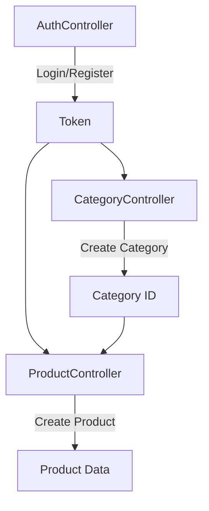
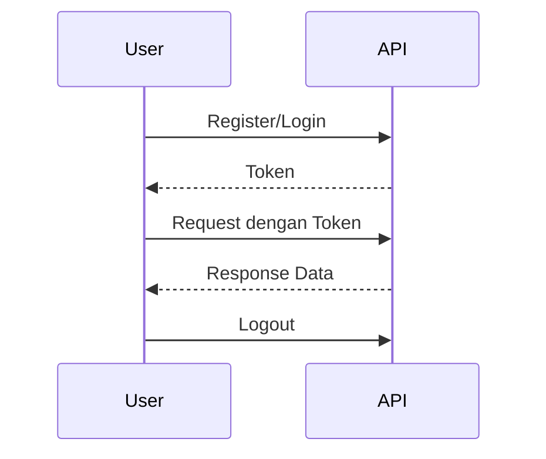
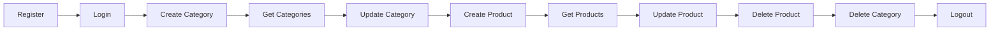

# 🛒 Marketplace API

RESTful API untuk aplikasi marketplace berbasis **Laravel**, dirancang dengan arsitektur yang clean dan scalable.
Project ini mencakup autentikasi, manajemen kategori, dan produk dengan relasi yang terstruktur.

---

## ✨ Highlight Project

- 🔐 Token Authentication (Sanctum)
- 📂 Modular Controller Structure
- 🔗 Relasi Category & Product
- 🧪 Siap digunakan dengan Postman
- 📊 Clean API Response Structure

---

## 🧠 Arsitektur API

Berikut alur hubungan antar controller:



📌 Penjelasan:

- AuthController menghasilkan token
- Token digunakan untuk akses Category & Product
- Product bergantung pada Category

---

## 🚀 Fitur Utama

### 🔐 Authentication

- Register
- Login
- Logout

### 📂 Category Management

- Create Category
- Get Categories
- Update Category
- Delete Category

### 📦 Product Management

- Create Product
- Get Products
- Update Product
- Delete Product

---

## 🛠️ Tech Stack

- Laravel
- MySQL
- Postman

---

## ⚙️ Instalasi

```bash
git clone https://github.com/saifudinreza/marketplace-api.git
cd marketplace-api
composer install
cp .env.example .env
php artisan key:generate
```

### Setup Database

```env
DB_DATABASE=marketplace
DB_USERNAME=root
DB_PASSWORD=
```

```bash
php artisan migrate
php artisan serve
```

---

## 🔐 Authentication Flow



---

## 🔄 API Usage Flow (Best Practice)

Ikuti urutan ini saat testing:



---

## 📦 Penjelasan Controller

### 🔐 AuthController

Mengelola autentikasi:

- `register()` → membuat akun
- `login()` → generate token
- `logout()` → revoke token

---

### 📂 CategoryController

Mengelola kategori:

- `index()` → ambil semua kategori
- `store()` → tambah kategori
- `update()` → edit kategori
- `destroy()` → hapus kategori

📌 Category wajib dibuat sebelum Product

---

### 📦 ProductController

Mengelola produk:

- `index()` → ambil semua produk
- `store()` → tambah produk
- `update()` → edit produk
- `destroy()` → hapus produk

📌 Product membutuhkan `category_id`

---

## 🔗 Endpoint API

| Method | Endpoint             | Keterangan      |
| ------ | -------------------- | --------------- |
| POST   | /api/register        | Register        |
| POST   | /api/login           | Login           |
| POST   | /api/logout          | Logout          |
| GET    | /api/categories      | Get Categories  |
| POST   | /api/categories      | Create Category |
| PUT    | /api/categories/{id} | Update Category |
| DELETE | /api/categories/{id} | Delete Category |
| GET    | /api/products        | Get Products    |
| POST   | /api/products        | Create Product  |
| PUT    | /api/products/{id}   | Update Product  |
| DELETE | /api/products/{id}   | Delete Product  |

---

## 🧪 Panduan Postman

### 🔧 Setup Environment

```
base_url = http://127.0.0.1:8000/api
token =
category_id =
product_id =
```

---

### 🔑 Authorization

Gunakan di setiap request:

```
Authorization: Bearer {{token}}
```

---

### ▶️ Workflow Testing

1. Login → simpan token
2. Create Category → simpan ID
3. Create Product → gunakan category_id
4. Lakukan testing CRUD lainnya

---

## 📊 Contoh Response

```json
{
    "success": true,
    "message": "Success",
    "data": {}
}
```

---

## 📌 Best Practice

- Gunakan environment variable di Postman
- Selalu login sebelum akses API
- Validasi relasi category sebelum create product

---

## 👨‍💻 Author

**Saifudin Reza**

---

## 🚀 Future Improvement

- Upload image product
- Pagination & filtering
- Role-based authentication
- Documentation Swagger

---

## ⭐ Closing

Project ini dibuat sebagai bagian dari perjalanan menjadi Fullstack Developer.
Jika project ini membantu, jangan lupa kasih ⭐ di repository 🙌
